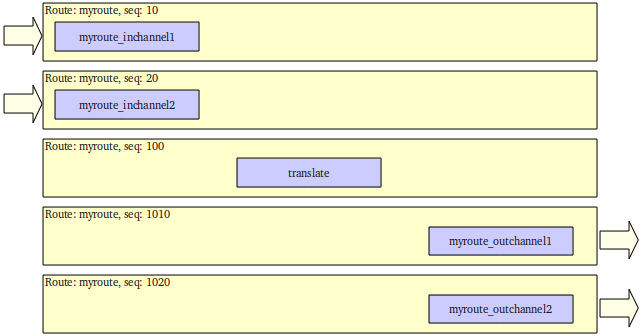

## Composite routes

### Introduction

A simple route reads the edi files from one inchannel, translates, and sends the translated files
to one outchannel.  
More flexibility is offered by the use of composite routes.  
In a composite route there are several entries in the routes screen,
each with the same 'idroute' but a different 'seq' (sequence number
within route). Each entry (with different 'seq') is called
**route-part**.  
Best way to use this is to have each route-part do one thing; either:

-   fetch incoming files; you can fetch files from multiple sources
-   translate (typically once per route)
-   send outgoing files to different destinations/partners using
    [filtering](RoutesComposite#Filtering.md) It is advised to set up
    composite routes this way (using at least 3 route-parts).

### Use cases

-   Send edi files via ftp where each partner has its own ftp-server.
-   Confirmations/acknowledgements: acknowledgements for incoming
    edi-files are routed back to the sender (filter by
    editype/messagetype).
-   Fetch from multiple sources, eg ftp-servers of different partners..
-   Route to different internal destinations: invoices to another system
    than ASN's (filter by messagetype)
-   Use a VAN, but one partner uses AS2 (filter by partner)
-   Incoming files are translated multiple times, each message-type goes
    to different destination. Eg: translate orders both to in-house file
    (import ERP) and an HTML-email (for viewing).

### Example plugin

Download [the plugin demo\_composite\_route](http://sourceforge.net/projects/bots/files/plugins/)  
This plugin has one composite route consisting of:

-   2 input parts
-   translate part
-   3 output parts, using filtering
    Detailled description [here](PluginList.md)

### Filtering for different outchannels

You can filter per outchannel; eg send only asn's through this outchannel.  

In route-screen (*bots-monitor-\>Configuration-\>Routes*) the fields
used for filtering under 'Filtering for outchannel'.  

If eg. *toeditype=csv*, only csv-files will be sent over the
outchannel.  

NOTE: if filtering is not specified, all outgoing files in the route
are sent through the outchannel.

### Schematic

Schematic overview of a route consisting of 5 parts:
 

Notes:

-	if no inchannel in route-part nothing comes in for that route-part.
-	if 'translate' in a route-part is off, no translation in that
	route-part.
-	if no outchannel in route-part nothing goes out for that route-part.

